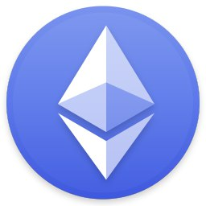
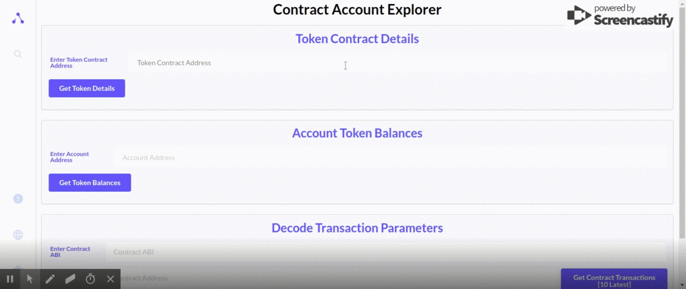
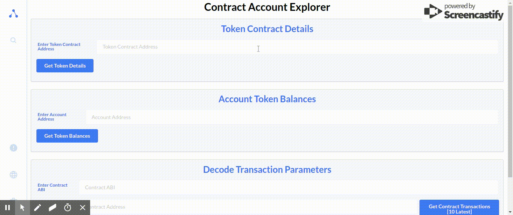
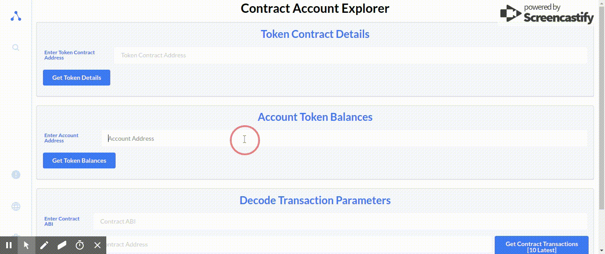

<p align="center"></p>
<h1 align="center">pay-no-load</h1>
<p><h3 align="center">A plugin for the Alethio Ethereum lite-explorer</h3></p>

---

<p align="center">:tada::tada::tada::tada:</p>


## Setting up the lite-explorer and the plugin

1. Clone the lite-explorer repo, and run the following commands in your terminal, one by one :

```javascript
$ git clone https://github.com/Alethio/ethereum-lite-explorer.git
$ cd ethereum-lite-explorer
$ npm install
$ cp config.default.json config.dev.json
```

2. Remove the version query strings `?v=#.#.#` from the "plugins" URIs in `config.dev.json`.

3. Build the lite-explorer:
   `npm run build`

4. Now, in another terminal tab, _while inside ethereum-lite-explorer_ install `cms-plugin-tool` and the plugins by running:

```
$ npm i -g @alethio/cms-plugin-tool@1.0.0-beta.3
$ acp install --dev \
    @alethio/explorer-plugin-eth-common \
    @alethio/explorer-plugin-eth-lite \
    @alethio/explorer-plugin-3box
    smitrajput/pay-no-load
```

<!-- 4. Change into the plugin repo, install node packages and build the modules:

```javascript
$ cd pay-no-load
$ npm install
$ npm run build
``` -->

<!-- 5. Install the plugin into the lite-explorer by running the following command _while inside ethereum-lite-explorer_ :

```javascript
$ cd ..
$ acp install ./pay-no-load
``` -->

5. Now, inside the file `config.dev.json` in the lite-explorer repo, add the module and page definations for loading the module :

Adding the plugin :

```json
"plugins": {
...
    "plugin://aleth.io/eth-common": {
    },
    "plugin://aleth.io/payts": {}
...},
```

Adding the page definition :

```json
{
  "def": "page://aleth.io/payts/profile-page",
  "children": {
    "content": [{ "def": "module://aleth.io/payts/profile" }]
  }
}
```

<!-- Adding icon to the homepage :

```json
{...
"def": "page://aleth.io/dashboard",
"children": {
    "content": [
        { "def": "module://aleth.io/search" },
        { "def" : "module://aleth.io/pay-no-load/home-link" }, ...
``` -->

6. Clone the plugin repo, install its dependencies, change to parent directory, link it to the explorer and start the server:

```
git clone https://github.com/smitrajput/pay-no-load.git
cd pay-no-load
npm i
cd ..
acp link pay-no-load
npm start
```

7. The page with URL `http://localhost:3000/` will open automatically, showing the lite-explorer home page. Go to URL `http://localhost:3000/profile` to access the pay-no-load plugin.

## Features

---

### Displays:

#### 1. token contract metadata (i.e. total supply, symbol, decimals, etc.)



#### 2. all token balances for a given wallet address



#### 3. latest transactions from/to a contract address


#### 4. _decoded payloads (parameters/arguments) of transactions_ [most IMPORTANT feature; hence the repo name ;-)]

<hr />

<p align="center">Made with ❤️ by <a href="https://www.linkedin.com/in/smit-r-417517139/">Smit Rajput</a> • <a href="https://www.linkedin.com/in/akash981/"> Akash</a> • <a href="https://www.linkedin.com/in/tezan-sahu-a85802163/">Tezan Sahu</a> </a>
```
